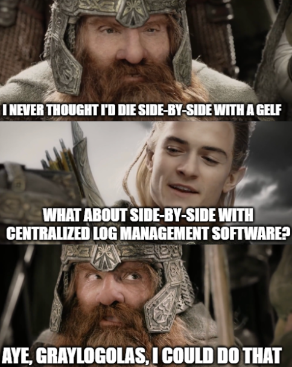

# Graylogolas

Docker logging to Seq via GELF.



## Setup

```shell
docker compose up -d
```

Set the following in your Docker config / `daemon.json`:

```json
{
  "log-driver": "gelf",
  "log-opts": {
    "gelf-address": "udp://127.0.0.1:12201"
  }
}
```

Apply and restart.

## Troubleshooting

If you don't see logs in Seq, try recreating containers so they pull in the new
default logging settings you set above.

## Additional Info
- https://docs.datalust.co/docs/using-gelf
- https://docs.datalust.co/docs/collecting-docker-container-logs